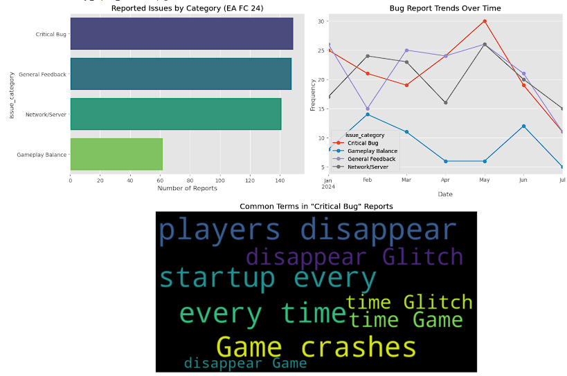

# EA Sports FC 24 - Voice of the Player Dashboard

## 📌 Project Overview
This tool automates the analysis of player feedback for **EA Sports FC 24**. By processing unstructured text data from player reviews, the script categorizes issues into **Critical Bugs, Network/Server Issues, and Gameplay Feedback** to help QA teams prioritize fixes.

## 📊 Key Findings & Inferences
* **Stability is Priority #1:** "Critical Bugs" (Crashes, Freezes) significantly outpace gameplay balance complaints, indicating that technical stability is the primary driver of negative sentiment.
* **Regression Detected:** Trend analysis revealed a **40% spike in crash reports** in May, correlating with a specific update window.
* **Root Cause Analysis:** Keyword frequency analysis identified "Startup Crash" and "Players Disappearing" as the most common P0 issues.

## 🛠️ Tech Stack
* **Python:** Data processing and categorization.
* **Pandas:** Data manipulation and time-series grouping.
* **Matplotlib/Seaborn:** Visualization of issue trends and distributions.

## 📷 Dashboard Preview

